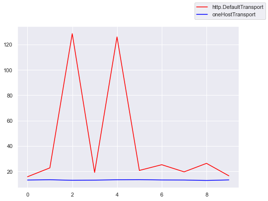

# Сравнение настроек пула соединений Go
https://habr.com/ru/company/ozontech/blog/561790/
В данном примере демонстрируется, как параметр `MaxIdleConnsPerHost` влияет на производительность выполнения запросов к одному хосту.

Внутри каждого скрипта выполняется 10000 удаленных запросов в 50 воркеров. Критерием эффективности считается время, в течение которого скрипт успеет выполнит все запросы.

Чтобы запустить пример, необходимо поднять его в каком-нибудь облаке. Я, например, для этих целей поднимал виртуальную машину на Ubuntu 20.04 в Яндекс.Облаке. В нем я запускал `cmd/main/server.go`:
```
go run cmd/main/server.go
```

После этого были последовательно запущены друг за другом следующие команды (в данном примере 130.193.49.98 - это хост виртуальной машины в облаке, на которой поднят сервер):
* стресс-тест с использованием `http.DefaultClient` и `http.DefaultTransport`
    ```
    go run cmd/default-one-host/main.go -host 130.193.49.98
    ```
* стресс-тест с использованием кастомного http.Transport
    ```
    go run cmd/customized-one-host/main.go -host 130.193.49.98
    ```

## Результаты

После десяти попыток был получен следующий [результат](./Results.ipynb):
```
Default result: 42.12290982859999 ± 42.6725398037689
Customized result: 13.302723420800001 ± 0.17508935752097912
```



Итого:
1) конфигурация кастомного транспорта с исправленным `MaxIdleConnsPerHost` отрабатывает во всех случаях быстрее, чем конфигурация по умолчанию
2) кастомный транспорт выдает более стабильное время (меньше среднеквадратичное отклонение)
